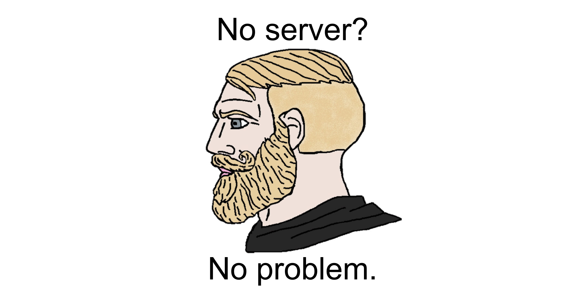
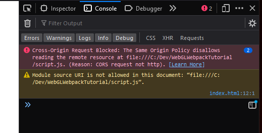
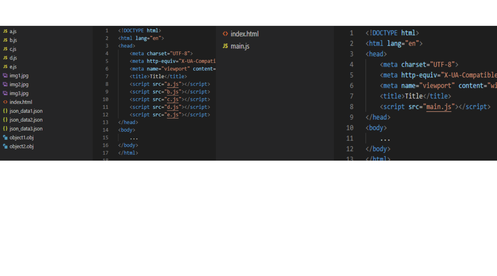
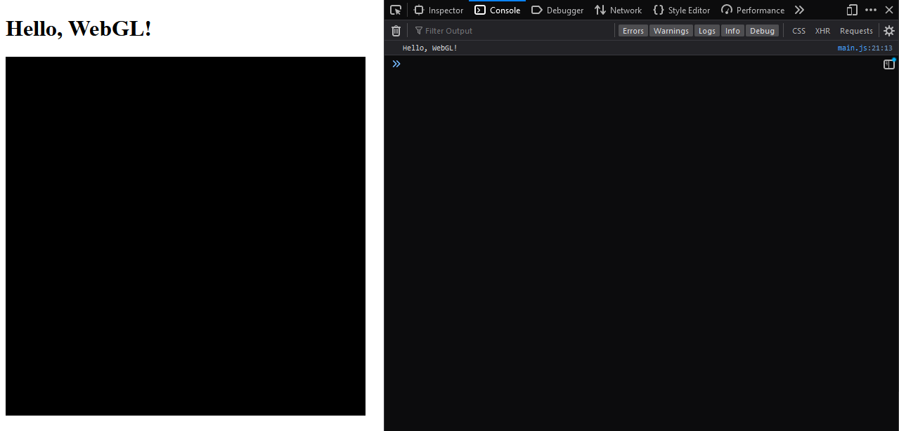
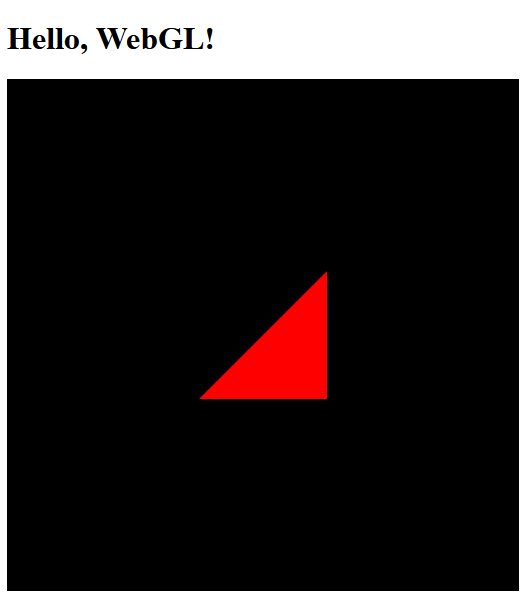
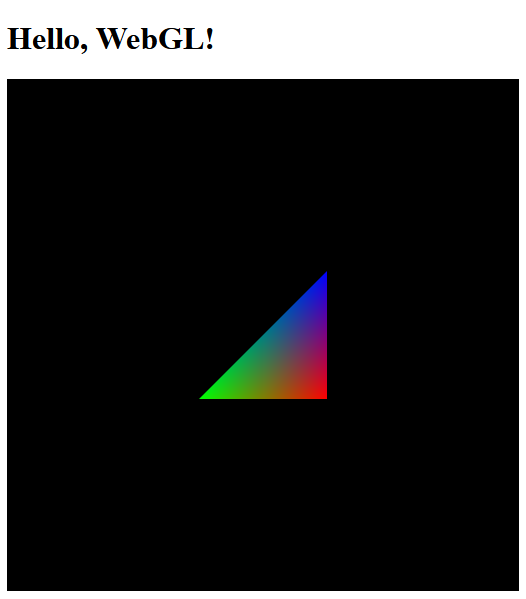
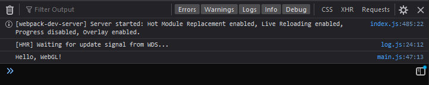

# Completely Standalone Web Apps with Webpack



### Table of Contents

- [Quick Start](#quick-start)
- [The Problem](#the-problem)
- [The Solution](#the-solution)
  - [What is Webpack?](#what-is-webpack)
- [Getting Started](#getting-started)
  - [Hello, World!](#hello-world)
  - [Installing Node.js](#installing-nodejs)
  - [Setting Up Webpack](#setting-up-webpack)
- [Loading Static Assets with Webpack](#loading-static-assets-with-webpack)
  - [Installing Loaders](#installing-loaders)
  - [Using Loaders](#using-loaders)
  - [Another Example](#another-example)
- [Extras (Recommended)](#extras-recommended)
  - [HTML Templates](#html-templates)
  - [Build Scripts (Development vs Production)](#build-scripts-development-vs-production)
  - [Hot Reloading](#hot-reloading)
  - [TypeScript](#typescript)
  - [Source Maps](#source-maps)

## Quick Start

1. Clone the repo and extract the example project from the `complete` folder. This includes a basic Webpack/WebGL program with support for Node build scripts, an HTML template file, hot reloading, TypeScript, and source maps.
2. Install Node.js if you haven't already (and if you do have to install it, make sure to restart your PC afterwards).
3. Navigate to the root directory of the project in the shell/terminal/command line.
3. Initialize the project by running `npm install`.
4. Test the project in development by running `npm run serve`. This will support hot reloading.
5. Build the project by running `npm run build`. To distribute your project after building it, just zip up the `dist` folder.

## The Problem

It's important to recognize that:

- Data is just as meaningful as the code that processes it, and that...
- Code and data should be kept separate.

This is a problem for standalone, static web apps that handle large amounts of data because:

- If data isn't embedded in code, then it must be loaded at runtime, but...
- It's impossible to load data from a separate file to a static web page at runtime without receiving the following error:



_I hate you, CORS._

There are two ways to bypass CORS: host the app on a web server or host the data on a web server and load it into the app from its URL. Unfortunately, I'm a stingy college student and even if I did pay for a web server, I still need to submit my web app as a standalone "executable" so my grader can simply double-click it, open it, and grade it. And if the link to the data ever goes dead, then the application would appear broken to him and to my future self that may want to revaluate old work.

## The Solution

It's important to remember that:

- A big reason why we keep data separate from code is because it makes projects easier to develop and maintain.

An easy solution to our problem, then, is to just **wait** to embed the data within the code until it's time to build and deploy. For standalone, static web apps, we can do this using Webpack.

### What is Webpack?

> At its core, webpack is a static module bundler for modern JavaScript applications. When webpack processes your application, it internally builds a dependency graph from one or more entry points and then combines every module your project needs into one or more bundles, which are static assets to serve your content from. -Webpack Concepts, https://webpack.js.org/concepts/

Basically, Webpack is a **build tool** for JavaScript applications. In terms of the problem we're trying to solve, Webpack allows us to separate data from code until we no longer can. At that point, Webpack squeezes everything into a single and compact JavaScript file. Here's an illustration:



As illustrated, Webpack also supports scalable JavaScript applications by condensing multiple inter-dependent files into just one. Gone are the days of importing every single file you need in the order you use them. You can read more about Webpack at https://webpack.js.org/concepts/.

## Getting Started

Before we load any data using Webpack, let's get a simple project up and running to get comfortable with building and deploying applications. This tutorial is based around WebGL, so our simple program will include loading a canvas with a WebGL context, but no drawing just yet.

### Hello, World!

Create a JavaScript file called `main.js` and paste in the following contents:

```js
// main.js

// Initialize the WebGL context.
const canvas = document.getElementById("webgl-canvas");
const gl = canvas.getContext("webgl2");

main();

/**
 * Make sure the WebGL context has been initialized, then clear the canvas.
 */
function main() {
    // Validate the rendering context.
    if (gl === null) {
        bash.error("Unable to initialize WebGL. Your browser or machine may not support it.");
        return;
    }

    // Clear the canvas.
    gl.clearColor(0.0, 0.0, 0.0, 1.0);
    gl.clear(gl.COLOR_BUFFER_BIT);

    bash.log("Hello, WebGL!");
}
```

Now, we need an HTML file with a canvas to make sure the script loads. Create an HTML file called `index.html` in the same directory as your `main.js` and paste in the following contents:

```html
<!-- index.html -->

<!DOCTYPE html>
<html lang="en">
<head>
    <meta charset="UTF-8">
    <meta http-equiv="X-UA-Compatible" content="IE=edge">
    <meta name="viewport" content="width=device-width, initial-scale=1.0">
    <title>Hello, WebGL!</title>
</head>
<body>
    <h1>Hello, WebGL!</h1>
    <canvas id="webgl-canvas" width="512" height="512"></canvas>
</body>
<script src="main.js"></script>
</html>
```

Open up `index.html` in your web browser, and you should see the following output:



### Installing Node.js

Now that we have a simple "hello, world" program, let's integrate Webpack to allow easy changes in the future with minimal effort. Before we can do this, we must add npm to our project which requires Node.js to be installed. If you already have Node.js installed, skip to [Setting Up Webpack](#setting-up-webpack). Otherwise, you can follow these instructions:

1. Download and install Node.js from https://nodejs.org/en/download. The latest LTS version is fine, and I would recommend downloading and running the installer.
2. While installing, keep clicking `Next` and allow for the full installation with the default settings.
3. Restart your computer to ensure path files are updated and that Node.js is fully installed.
4. Open up your terminal (`` ctrl + shift + ` `` in Visual Studio Code), type `npm version` and hit `Enter`. You should get an output similar to the following:
```bash
C:\Dev\WebGLWebpackTutorial>npm version
{
  npm: '9.5.0',
  node: '18.15.0',
  v8: '10.2.154.26-node.25',
  uv: '1.44.2',
  zlib: '1.2.13',
  brotli: '1.0.9',
  ares: '1.18.1',
  modules: '108',
  nghttp2: '1.51.0',
  napi: '8',
  llhttp: '6.0.10',
  uvwasi: '0.0.15',
  acorn: '8.8.2',
  simdutf: '3.1.0',
  undici: '5.20.0',
  openssl: '3.0.8+quic',
  cldr: '42.0',
  icu: '72.1',
  tz: '2022g',
  unicode: '15.0',
  ngtcp2: '0.8.1',
  nghttp3: '0.7.0'
}
```
5. If you instead you get `'npm' is not recognized as an internal or external command,
operable program or batch file.` or something similar, make sure you have restarted your computer after the Node.js installation and refer to Google or Stack Overflow it if that fails.

### Setting Up Webpack

Now that we have Node.js installed, we can finally set up Webpack. You can follow the comprehensive guide at https://webpack.js.org/guides/getting-started/, or use the following instructions:

1. Open up the terminal in your project's root directory.
2. Run `npm init -y` (`y` means skip the questionnaire that npm uses to initialize your project; this is general housekeeping stuff such as project name, version, etc). You should get the following output:
```bash
C:\Dev\WebGLWebpackTutorial>npm init -y
Wrote to C:\Dev\WebGLWebpackTutorial\package.json:

{
  "name": "webglwebpacktutorial",
  "version": "1.0.0",
  "description": "1. Download the example project.\r 2. Install Node.js if you haven't already.\r 3. Navigate to the root directory of the project in the shell/command line.\r 3. Initialize by running `npm init`.\r 4. Test by running `npm run serve`.\r 5. Build by running `npm run build`.",        
  "main": "main.js",
  "scripts": {
    "test": "echo \"Error: no test specified\" && exit 1"
  },
  "keywords": [],
  "author": "",
  "license": "ISC"
}
```
3. Run `npm install webpack webpack-cli --save-dev` (`webpack-cli` is the tool used to run Webpack on the command line; `--save-dev` means Webpack will be installed as a dev dependency, but won't be distributed with the final build). You should get the following output or similar:
```bash
C:\Dev\WebGLWebpackTutorial>npm install webpack webpack-cli --save-dev

added 117 packages, and audited 118 packages in 8s

15 packages are looking for funding
  run `npm fund` for details

found 0 vulnerabilities
npm notice
npm notice New minor version of npm available! 9.5.0 -> 9.6.2
npm notice Changelog: https://github.com/npm/cli/releases/tag/v9.6.2
npm notice Run npm install -g npm@9.6.2 to update!
npm notice
```
4. You can ignore most notices and warnings. The important part is that Webpack installs without any errors. If there are errors, refer to Google or Stack Overflow.
5. Run `dir` (Windows) or `ls` (Linux/MacOS) to make sure your project directory looks something like this:
```bash
 Directory of C:\Dev\WebGLWebpackTutorial

03/25/2023  08:53 PM    <DIR>          .
03/25/2023  08:53 PM    <DIR>          ..
03/25/2023  08:10 PM               421 index.html
03/25/2023  08:07 PM               579 main.js
03/25/2023  08:49 PM    <DIR>          node_modules
03/25/2023  08:49 PM            49,638 package-lock.json
03/25/2023  08:49 PM               586 package.json
```
6. Create a folder called `src` at the project's root directory and place `main.js` into it. The `src` folder is where we'll place all our source code.
7. Create a folder called `dist` at the project's' root directory and place `index.html` into it. `dist` is [short for "distributable,"](https://stackoverflow.com/questions/22842691/what-is-the-meaning-of-the-dist-directory-in-open-source-projects) so this is the folder that we'll zip up and distribute as our standalone application. Your project directory should now look like this:
```bash
 Directory of C:\Dev\WebGLWebpackTutorial

03/25/2023  09:13 PM    <DIR>          .
03/25/2023  09:13 PM    <DIR>          ..
03/25/2023  09:13 PM    <DIR>          dist
03/25/2023  08:49 PM    <DIR>          node_modules
03/25/2023  08:49 PM            49,638 package-lock.json
03/25/2023  08:49 PM               586 package.json
03/25/2023  09:07 PM    <DIR>          src
```
8. Create a file in the root directory called `webpack.config.js` and paste in the following contents:
```js
const path = require('path');

module.exports = {
  entry: './src/main.js',
  output: {
    filename: 'main.js',
    path: path.resolve(__dirname, 'dist'),
  },
};
```
9. `entry` requires a relative path, hence `./src/main.js`, while output requires an absolute file path, hence `path.resolve(__dirname, 'dist')`.
10. Run `npx webpack`. You should get the following output:
```bash
C:\Dev\WebGLWebpackTutorial>npx webpack
asset main.js 257 bytes [emitted] [minimized] (name: main)
./src/main.js 579 bytes [built] [code generated]

WARNING in configuration
The 'mode' option has not been set, webpack will fallback to 'production' for this value.
Set 'mode' option to 'development' or 'production' to enable defaults for each environment.
You can also set it to 'none' to disable any default behavior. Learn more: https://webpack.js.org/configuration/mode/

webpack 5.76.3 compiled with 1 warning in 233 ms
```
11. Ignore the warning, we'll fix that later. For now, open up `dist/index.html` and make sure you get the following output once again:


## Loading Static Assets with Webpack

Now that we've set up Webpack, we can start loading static assets into our project at build-time. To demonstrate this, we'll write some shader code in separate files that will be imported in `main.js`.

1. Underneath the `src` folder, create a new folder called `shaders`.
2. Inside of the `shaders` folder, create two new files: `vertex.glsl` and `fragment.glsl` with the following contents respectively:

```glsl
#version 300 es
// vertex.glsl - from the OpenGL SuperBible Sixth Edition

void main(void)
{
    const vec4 vertices[3] = vec4[3](
        vec4(0.25, -0.25, 0.5, 1.0),
        vec4(-0.25, -0.25, 0.5, 1.0),
        vec4(0.25, 0.25, 0.5, 1.0)
    );

    gl_Position = vertices[gl_VertexID];
}
```

```glsl
#version 300 es
// fragment.glsl - from the OpenGL SuperBible Sixth Edition

precision highp float;

out vec4 color;

void main(void)
{
    color = vec4(1.0, 0.0, 0.0, 1.0);
}
```

The preceding shader code is a minimal example of how to draw a red triangle in the middle of the screen.

### Installing Loaders

To get the GLSL shaders into our JavaScript without worrying about CORS, we'll configure Webpack to preprocess the data, embedding it into our code at build-time. Unfortunately, Webpack must be explicitly told how to handle files of any given type, but the process isn't too painful. It's most streamlined by the concept of loaders.

> Webpack enables use of loaders to preprocess files. This allows you to bundle any static resource way beyond JavaScript. You can easily write your own loaders using Node.js. -Webpack Loaders, https://webpack.js.org/loaders/

Loaders can be used to preprocess JSON, HTML, Markdown, CSS, and many other file types which you can read about at https://webpack.js.org/loaders/. In our case, we'll use the `webpack-glsl-loader` which someone else has kindly written for us and uploaded to npm at https://www.npmjs.com/package/webpack-glsl-loader.

To configure Webpack to use this loader, follow these instructions:

1. Run `npm install --save-dev webpack-glsl-loader`; read the bash output to verify the package was installed correctly.
2. Add the following lines to your `webpack.config.js` file:

```js
module: {
  rules: [
    {
      test: /\.glsl$/, // regex to match files with the .glsl extension
      loader: 'webpack-glsl-loader'
    }
  ]
},
```

The complete contents of `webpack.config.js` should now look something like this:

```js
const path = require('path');

module.exports = {
  entry: './src/main.js',
  module: {
    rules: [
      {
        test: /\.glsl$/, // regex to match files with the .glsl extension
        loader: 'webpack-glsl-loader'
      }
    ]
  },
  output: {
    filename: 'main.js',
    path: path.resolve(__dirname, 'dist'),
  },
};
```

### Using Loaders

To use a loader to load static assets into JavaScript, you must call the `require(filePath)` method where `filePath` is the path to your static asset relative to the file you're loading it from. To load our shaders into `main.js`, we'll add the following lines to our main method after we initialize the WebGL context:

```js
// Load the shaders
let vertexShader = require("./shaders/vertex.glsl");
let fragmentShader = require("./shaders/fragment.glsl");
```

As stated in the `glsl-webpack-loader` documentation, the "shader is returned as a string" so to verify the loader is working, we'll simply print the contents of the shader to the bash using the following lines:

```js
// Verify the shaders were loaded
bash.log(vertexShader);
bash.log(fragmentShader);
```

Go back to your terminal and build the project again using the `npx webpack` command. Now, reopen your `index.html` file and you should see the following output in the browser's bash:


It's great that the loader is working, but we should try to compile the shaders instead of just printing them out to the bash. Let's edit the main function to use the shaders after loading them. The resulting code looks something like this:

```js
// Initialize the WebGL context.
const canvas = document.getElementById("webgl-canvas");
const gl = canvas.getContext("webgl2");

main();

function createShader(gl, type, source) {
    let shader = gl.createShader(type);
    gl.shaderSource(shader, source);
    gl.compileShader(shader);
    return shader;
}

/**
 * Make sure the WebGL context has been initialized, then clear the canvas.
 */
function main() {
    // Validate the rendering context.
    if (gl === null) {
        bash.error("Unable to initialize WebGL. Your browser or machine may not support it.");
        return;
    }

    let shaderProgram = gl.createProgram();

    // Load the shaders
    let vertexShaderSource = require("./shaders/vertex.glsl");
    let fragmentShaderSource = require("./shaders/fragment.glsl");

    // Create the shaders
    let vertexShader = createShader(gl, gl.VERTEX_SHADER, vertexShaderSource);
    let fragmentShader = createShader(gl, gl.FRAGMENT_SHADER, fragmentShaderSource);

    // Link the shaders
    gl.attachShader(shaderProgram, vertexShader);
    gl.attachShader(shaderProgram, fragmentShader);
    gl.linkProgram(shaderProgram);

    gl.useProgram(shaderProgram);

    // Clear the canvas.
    gl.clearColor(0.0, 0.0, 0.0, 1.0);
    gl.clear(gl.COLOR_BUFFER_BIT);

    gl.drawArrays(gl.TRIANGLES, 0, 3);

    bash.log("Hello, WebGL!");
}
```

Rebuild the project and reopen your `index.html` file, and you should see the following drawing on the page:



The output isn't very impressive and our WebGL program leaves a lot to be desired, but it's an effective and simple example of the power of Webpack. If you want more impressive results, you could try importing [Wavefront .obj files](https://en.wikipedia.org/wiki/Wavefront_.obj_file) using a loader such as the one found at https://github.com/frenchtoast747/webgl-obj-loader.

### Another Example

Since I made such a big deal at the beginning of this tutorial about the separation of data and code, let's fix a part of our project that blatantly violates this principle. In particular, our vertex shader holds a static array of vertices that we should probably store in a separate file.

Change `vertex.glsl` and `fragment.glsl` to have the following contents respectively:

```glsl
#version 300 es
// vertex.glsl

layout(location = 0) in vec4 a_position;
layout(location = 1) in vec4 a_color;

out vec4 color;

void main(void)
{
    gl_Position = a_position;
    color = a_color;
}
```

```glsl
#version 300 es
// fragment.glsl

precision highp float;

in vec4 color;
out vec4 FragColor;

void main(void)
{
    FragColor = color;
}
```

Now, we must create a file that stores the description of the triangle we want to render. In your root directory, create a new folder called `assets` and underneath this folder, create a new file called `triangle.json` and paste in the following contents:

```json
{
    "vertices": [
         0.25, -0.25, 0.5, 1.0,
        -0.25, -0.25, 0.5, 1.0,
         0.25,  0.25, 0.5, 1.0
    ],
    "colors": [
        1.0, 0.0, 0.0, 1.0,
        0.0, 1.0, 0.0, 1.0,
        0.0, 0.0, 1.0, 1.0
    ]
}
```

Now, we need to load the triangle into our `main.js` file. Webpack is capable of loading JSON files by default, so we don't need to install an additional loader. Add the following lines to the beginning of the main method of your `main.js` file:

```js
// Load the triangle
let triangle = require("../assets/triangle.json");
```

The built-in JSON loader maps the JSON object to a POJO (plain-old JavaScript object), meaning we can call `triangle.vertices` or `triangle.colors` in our JavaScript to get the triangle's vertices and colors respectively. You can verify this works by printing out the contents of these properties or by setting a breakpoint and inspecting the value, but I'm going to assume it's loading correctly.

We also have to change our code to use the vertices and colors of the triangle in our shader, which requires some additional setup of WebGL. Add a new method to `main.js` with the following contents:

```js
function createBuffer(gl, data) {
    let buffer = gl.createBuffer();
    gl.bindBuffer(gl.ARRAY_BUFFER, buffer);
    gl.bufferData(gl.ARRAY_BUFFER, new Float32Array(data), gl.STATIC_DRAW);
    return buffer;
}
```

This method includes boilerplate code to create a WebGL buffer. We still need to enable the attributes in the shaders, call the method to create the buffers with our triangle data, and send the data to the shaders. We must do this in the main method, after we load our triangle and enable our shader program. Add the following lines to your `main.js` file:

```js
// Enable the attributes
gl.enableVertexAttribArray(0);
gl.enableVertexAttribArray(1);

// Create the buffers
let vertexBuffer = createBuffer(gl, triangle.vertices);
let colorBuffer = createBuffer(gl, triangle.colors);

...

// Send the data to the shaders
gl.bindBuffer(gl.ARRAY_BUFFER, vertexBuffer);
gl.vertexAttribPointer(0, 4, gl.FLOAT, false, 0, 0);

gl.bindBuffer(gl.ARRAY_BUFFER, colorBuffer);
gl.vertexAttribPointer(1, 4, gl.FLOAT, false, 0, 0);
```

The full contents of `main.js` should now look something like this:

```js
// Initialize the WebGL context.
const canvas = document.getElementById("webgl-canvas");
const gl = canvas.getContext("webgl2");

main();

function createShader(gl, type, source) {
    let shader = gl.createShader(type);
    gl.shaderSource(shader, source);
    gl.compileShader(shader);
    return shader;
}

function createBuffer(gl, data) {
    let buffer = gl.createBuffer();
    gl.bindBuffer(gl.ARRAY_BUFFER, buffer);
    gl.bufferData(gl.ARRAY_BUFFER, new Float32Array(data), gl.STATIC_DRAW);
    return buffer;
}

/**
 * Make sure the WebGL context has been initialized, then clear the canvas.
 */
function main() {
    // Validate the rendering context.
    if (gl === null) {
        bash.error("Unable to initialize WebGL. Your browser or machine may not support it.");
        return;
    }

    // Load the triangle
    let triangle = require("../assets/triangle.json");

    let shaderProgram = gl.createProgram();

    // Load the shaders
    let vertexShaderSource = require("./shaders/vertex.glsl");
    let fragmentShaderSource = require("./shaders/fragment.glsl");

    // Create the shaders
    let vertexShader = createShader(gl, gl.VERTEX_SHADER, vertexShaderSource);
    let fragmentShader = createShader(gl, gl.FRAGMENT_SHADER, fragmentShaderSource);

    // Link the shaders
    gl.attachShader(shaderProgram, vertexShader);
    gl.attachShader(shaderProgram, fragmentShader);
    gl.linkProgram(shaderProgram);

    gl.useProgram(shaderProgram);

    // Enable the attributes
    gl.enableVertexAttribArray(0);
    gl.enableVertexAttribArray(1);

    // Create the buffers
    let vertexBuffer = createBuffer(gl, triangle.vertices);
    let colorBuffer = createBuffer(gl, triangle.colors);

    // Clear the canvas.
    gl.clearColor(0.0, 0.0, 0.0, 1.0);
    gl.clear(gl.COLOR_BUFFER_BIT);

    // Send the data to the shaders
    gl.bindBuffer(gl.ARRAY_BUFFER, vertexBuffer);
    gl.vertexAttribPointer(0, 4, gl.FLOAT, false, 0, 0);
    
    gl.bindBuffer(gl.ARRAY_BUFFER, colorBuffer);
    gl.vertexAttribPointer(1, 4, gl.FLOAT, false, 0, 0);

    gl.drawArrays(gl.TRIANGLES, 0, 3);

    bash.log("Hello, WebGL!");
}
```

Let's rebuild the project by running `npx webpack` on the command line. Open up your `index.html` file and this time you should see a triangle with colors interpolated between its vertices, as seen below. Keep in mind that you need to rebuild your project every time you make changes to `triangles.json`, but that it's still helpful to have the data in its own file to keep it separate from our code.



## Extras (Recommended)

Webpack is versatile and customizeable, so there's other things we can do to improve our experience with it.

### HTML Templates

Up until now, we've kept our `index.html` file in the `dist` folder, which isn't the best idea because this folder is usually ignored by version control. Instead, we can keep a generic template file in the `src` folder and configure Webpack to build an `index.html` file from the template. This is done using a Webpack plugin known as `HtmlWebpackPlugin` (a fitting name).

> The HtmlWebpackPlugin simplifies creation of HTML files to serve your webpack bundles. This is especially useful for webpack bundles that include a hash in the filename which changes every compilation. You can either let the plugin generate an HTML file for you, supply your own template using lodash templates, or use your own loader. -HtmlWebpackPlugin, https://webpack.js.org/plugins/html-webpack-plugin/

You can learn how to add the plugin to your Webpack build at https://webpack.js.org/plugins/html-webpack-plugin/, or use the following instructions to set it up:

1. Run `npm install --save-dev html-webpack-plugin` to install the plugin.
2. Add the following lines to your `webpack.config.js` file:

```js
const HtmlWebpackPlugin = require('html-webpack-plugin');

...

plugins: [
    new HtmlWebpackPlugin({
        title: "WebGLWebpackTutorial",
        filename: "index.html",
        template: "src/index.html"
    })
],
```

The complete contents of `webpack.config.js` should now look something like:

```js
const path = require('path');
const HtmlWebpackPlugin = require('html-webpack-plugin');

module.exports = {
  entry: './src/main.js',
  module: {
    rules: [
      {
        test: /\.glsl$/, // regex to match files with the .glsl extension
        loader: 'webpack-glsl-loader'
      }
    ]
  },
  output: {
    filename: 'main.js',
    path: path.resolve(__dirname, 'dist'),
  },
  plugins: [
    new HtmlWebpackPlugin({
        title: "Hello, WebGL!", // Replace this with the name of your app
        filename: "index.html",
        template: "src/index.html"
    })
  ],
};
```

3. Remove the `<script>` tag from your `index.html` file (the plugin will insert it automatically) and replace the title with `<%= htmlWebpackPlugin.options.title %>` (which is given by the `title` property in your `webpack.config.js`). Your `index.html` file should now look something like this:

```html
<!-- index.html -->

<!DOCTYPE html>
<html lang="en">
<head>
    <meta charset="UTF-8">
    <meta http-equiv="X-UA-Compatible" content="IE=edge">
    <meta name="viewport" content="width=device-width, initial-scale=1.0">
    <title>
        <%= htmlWebpackPlugin.options.title %>
    </title>
</head>
<body>
    <h1>
        <%= htmlWebpackPlugin.options.title %>
    </h1>
    <canvas id="webgl-canvas" width="512" height="512"></canvas>
</body>
</html>
```

4. Move your `index.html` file from the `dist` folder to the `src` folder.
4. Run `npx webpack` to build your project and open up the newly generated `index.html` file in the `dist` folder. Everything should appear normally and your script should still load despite not having a single `<script>` tag in your HTML template file.

### Build Scripts (Development vs Production)

One thing that we didn't address during the setup of the basic Webpack/WebGL program is the warning we get when we don't specify a `mode` for our build. The three options for this are `development`, `production`, and `none`, and they each affect how Webpack optimizes your project's code. If no mode is specified, Webpack uses `production` by default. To override the default, you can either specify the mode as an additional argument on the command line or in your `webpack.config.js` file. I prefer to supply this as a command line argument because I use Node [scripts](https://docs.npmjs.com/cli/v9/using-npm/scripts) to build my project. You can learn how to add a mode to your Webpack build at https://webpack.js.org/configuration/mode/, or use the following instructions to set it up like I do: 

1. Add the following line to your `package.json` file underneath the `scripts` property:

```json
"build": "webpack --mode production"
```

The complete contents of `package.json` should now look something like this:

```json
{
  "name": "webglwebpacktutorial",
  "version": "1.0.0",
  "description": "",
  "main": "main.js",
  "scripts": {
    "build": "webpack --mode production",
    "test": "echo \"Error: no test specified\" && exit 1"
  },
  "keywords": [],
  "author": "",
  "license": "ISC",
  "devDependencies": {
    "webpack": "^5.76.3",
    "webpack-cli": "^5.0.1",
    "webpack-glsl-loader": "^1.0.1"
  }
}
```

2. To build your project, navigate to the root directory of your project on the command line and run `npm run build`. This is the command you should use, from now on, to build your project, and you should no longer receive a warning from Webpack.

### Hot Reloading

It's nice to have a sophisticated build pipeline, but one of the good things about working with only JavaScript and HTML files was that if we made a change, all we had to do to see it was reload the page. Now with Webpack, everytime we make a change to our source code we have to rebuild our project which can get tedious and annoying. One way around this problem is the `webpack-dev-server`.

> The webpack-dev-server provides you with a rudimentary web server and the ability to use live reloading. -Using webpack-dev-server, https://webpack.js.org/guides/development/#using-webpack-dev-server

To set up the dev server you can use the guide at https://webpack.js.org/guides/development/#using-webpack-dev-server, or use the following instructions:

1. Run `npm install --save-dev webpack-dev-server`.
2. Add the following lines to your `webpack.config.js` file:

```js
devServer: {
  open: true,
  static: './dist'
},
```

The complete contents of `webpack.config.js` should now look something like this:

```js
const path = require('path');

module.exports = {
  entry: './src/main.js',
  devServer: {
    open: 'true',
    static: './dist'
  },
  module: {
    rules: [
      {
        test: /\.glsl$/, // regex to match files with the .glsl extension
        loader: 'webpack-glsl-loader'
      }
    ]
  },
  output: {
    filename: 'main.js',
    path: path.resolve(__dirname, 'dist'),
  },
};
```

Note that the line `open: true` will automatically open your project after you start the dev server. This is just a personal preference, and you may disable this feature but if you do you must manually navigate to `localhost:8080` in your browser to access the dev server after starting it. If you want this feature enabled but it doesn't work when you specify `open: true` in `webpack.config.js`, try adding the `--open` flag to your Webpack command (i.e. `webpack serve --open --mode development`).

3. Add the following lines to your `package.json` file under the `scripts` property:

```json
"serve": "webpack serve --mode development"
```

The complete contents of `package.json` should now look something like this:

```json
{
  "name": "webglwebpacktutorial",
  "version": "1.0.0",
  "description": "",
  "main": "main.js",
  "scripts": {
    "serve": "webpack serve --mode development",
    "test": "echo \"Error: no test specified\" && exit 1"
  },
  "keywords": [],
  "author": "",
  "license": "ISC",
  "devDependencies": {
    "webpack": "^5.76.3",
    "webpack-cli": "^5.0.1",
    "webpack-dev-server": "^4.13.2",
    "webpack-glsl-loader": "^1.0.1"
  }
}
```

4. To test your project in development, navigate to the root directory of your project on the command line and run `npm run serve`. This is the command you should use, from now on, to test your project and have the page hot reload after small changes without having to rebuild.
5. You should verify that hot reloading is enabled by running `npm run serve`, waiting for a browser window to open up at `localhost:8080` (or opening it up yourself), and verifying that the browser bash has the following output:



### TypeScript

> TypeScript is a strongly typed programming language that builds on JavaScript, giving you better tooling at any scale. -TypeScript, https://www.typescriptlang.org/

In other words, TypeScript is a superset of JavaScript with optional static typing. The purpose of using it is to prevent a class of errors in JavaScript, known as `TypeError`s, which are commonly associated with the language. These errors occurs when you assume an object extends or inherts from a type that it isn't actually related to. TypeScript solves this problem with an optional syntax that enforces type safety at compile-time. If you want to learn more about the language, visit https://www.typescriptlang.org/. To integrate TypeScript into Webpack you can use the guide at https://webpack.js.org/guides/typescript/, or use the following instructions:

1. Run `npm install --save-dev typescript ts-loader` to install the TypeScript compiler and loader locally.
2. Add the following lines to your `webpack.config.js` file:

```js
entry: './src/main.ts',
module: {
  rules: [
    {
      test: /\.ts$/, // regex to match files with the .ts extension
      loader: 'ts-loader'
    }
  ]
},
resolve: {
  extensions: ['.ts', '.js']
}
```

The complete contents of `webpack.config.js` should now look something like this:

```js
const path = require('path');

module.exports = {
  entry: './src/main.ts',
  module: {
    rules: [
      {
        test: /\.ts$/, // regex to match files with the .ts extension
        loader: 'ts-loader'
      },
      {
        test: /\.glsl$/, // regex to match files with the .glsl extension
        loader: 'webpack-glsl-loader'
      }
    ]
  },
  output: {
    filename: 'main.js',
    path: path.resolve(__dirname, 'dist'),
  },
  resolve: {
    extensions: ['.ts', '.js']
  }
};
```

3. In the root directory, create a new file called tsconfig.json with the following contents:

```json
{
    "compilerOptions": {
        "outDir": "./dist/",
        "noImplicitAny": false,
        "module": "es6",
        "target": "es5",
        "allowJs": true,
        "moduleResolution": "node"
    }
}
```

4. Rename `./src/main.js` to `./src/main.ts`. This should be enough to test that TypeScript is working, but you could also rewrite the basic WebGL program to include static typing. I have done this and included the source code under the `extras-typescript` folder.

Note that you might be getting errors when trying to compile `main.ts` because TypeScript is stricter than JavaScript. One change that you will probably have to make to the file is:

```ts
// TypeScript doesn't like the inference you make here
// const canvas = document.getElementById("webgl-canvas");
// const gl = canvas.getContext("webgl2");

// Much better
const canvas = document.getElementById("webgl-canvas") as HTMLCanvasElement;
const gl = canvas.getContext("webgl2");
```

5. Run `npx webpack` to build the project.
6. Open up `index.html` and verify that the program is still working as expected.

### Source Maps

One of the issues with Webpack is that the final JavaScript file it produces is minified and completely unreadable. This also means that it's impossible to debug it using the debugger built into your browser. [Source maps](https://firefox-source-docs.mozilla.org/devtools-user/debugger/how_to/use_a_source_map/index.html) are a neat way around this problem that allow you to debug the minified code (and I'm not going to pretend I understand how they work). What's even better is that they're super easy to set up. All you have to do is add the following line to your `webpack.config.js`:

```js
devtool: 'eval-source-map',
```

The complete contents of `webpack.config.js` should now look something like this:

```js
const path = require('path');

module.exports = {
  entry: './src/main.js',
  devtool: 'eval-source-map',
  module: {
    rules: [
      {
        test: /\.glsl$/, // regex to match files with the .glsl extension
        loader: 'webpack-glsl-loader'
      }
    ]
  },
  output: {
    filename: 'main.js',
    path: path.resolve(__dirname, 'dist'),
  },
};
```

Please note that there are other options for source maps and that these options affect your application's build time. You can find a full list of these options at https://webpack.js.org/configuration/devtool/, but I'm using `devtool: 'eval-source-map'` because it allows you to inspect the value of variables while you're stepping through code which is incredibly useful.

After you set up your source map, you need to rebuild your project with `mode` set to `development`. Then, when you open up your `index.html` file, you can access the source map by opening up your browser's debugger and going to the `Sources` tab. You can place breakpoints and step through source maps just like you can with the original code. Also, this varies slightly between Google Chrome and Mozilla Firefox, so I've included a screenshot of where to find it in Firefox, and links to the documentation for both browser.

- Debugging JavaScript in Google Chrome: https://developer.chrome.com/docs/devtools/javascript/.
- Debugging JavaScript in Mozilla Firefox: https://firefox-source-docs.mozilla.org/devtools-user/debugger/.


Keep in mind that if you're using both TypeScript and source maps in your Webpack project, you should add the following line to your `tsconfig.json`:

```json
"sourceMap": true,
```

The complete contents of `tsconfig.json` should now look something like this:

```json
{
    "compilerOptions": {
        "outDir": "./dist/",
        "noImplicitAny": false,
        "sourceMap": true,
        "module": "es6",
        "target": "es5",
        "allowJs": true,
        "moduleResolution": "node"
    }
}
```
